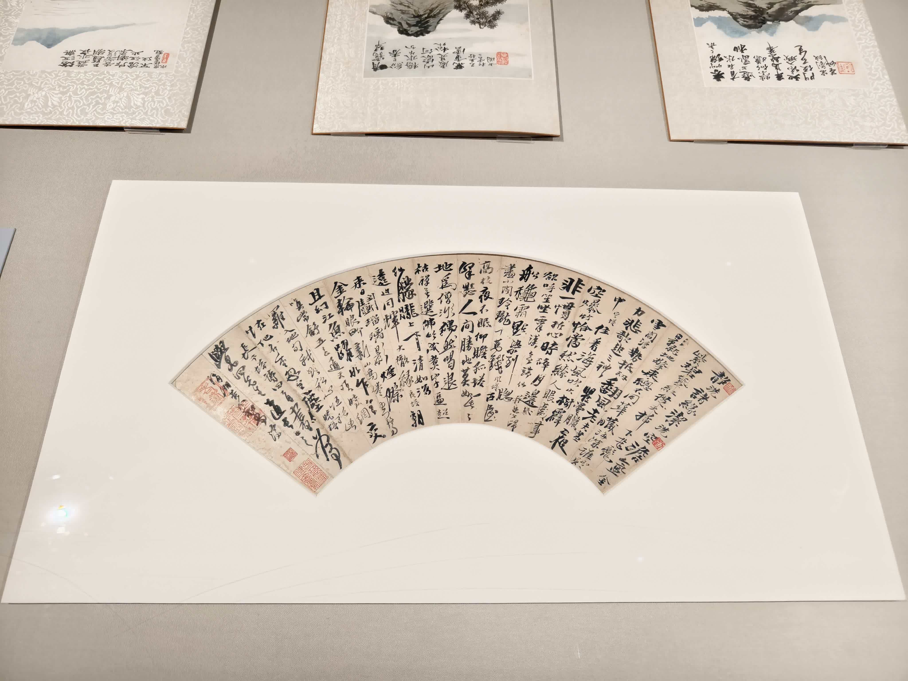

2025年年底因为一些事情需要回中国，大概2-3个月

<figure>
<figcaption>临走前，此时的肥咪还没有意识到问题的严重性</figcaption>
</figure>

## 波兰
在波兰华沙的肖邦机场转机（没错，他们的首都机场就叫肖邦机场），中午到晚上走，所以直接出来在附近转了一会儿。

等公交的时候一位中亚大叔（好像是巴基斯坦？忘了）上来表示不知道怎么买票，希望我帮他买一张，塞了一枚5波元的硬币给我，虽然我也不知道汇率是什么情况，但问题不大，帮他买了一张。

当时华沙气温零度，下着雨夹雪，冷死了。

### 肖邦博物馆
因为时间不多，就去附近的一个肖邦博物馆看了看。
<figure>
<figcaption>肖邦手稿，看不出来是哪首曲子</figcaption>
</figure>
<figure>
<figcaption>一个每天下午的半小时音乐会，大约是附近的音乐学院的学生演奏的吧</figcaption>
</figure>
<figure>
<figcaption>肖邦弹过的钢琴</figcaption>
</figure>
<figure>
<figcaption>肖邦坐过的椅子，浓厚的艺术气息（？）</figcaption>
</figure>

### 晚餐
出来之后天已经黑了，随便找了家餐厅，在门口RJ发作犹豫了好久才进去，好在服务员很友好。
吃了一个高智商生物的腿，这烤的也太嫩了不知道是怎么做的。
<figure>
<figcaption>章鱼</figcaption>
</figure>
<figure>
<figcaption>甜点感觉一般，甜味泡沫加柑橘味牙膏的感觉</figcaption>
</figure>

## 乌兹别克斯坦

また…ここに…(　^ω^)

这次吃了一些传统的乌兹别克料理。
- [Shorwa](https://en.wikipedia.org/wiki/Chorba):
一种汤：主要就是土豆和牛肉.
- [Norin](https://en.wikipedia.org/wiki/Naryn_(dish)):
一种通常配马肉的面食。
- [Manti](https://en.wikipedia.org/wiki/Manti_(food)):
一种……包子？这个没有拍照

<figure>
<figcaption>Norin</figcaption>
</figure>

<figure>
<figcaption>Shorwa
</figcaption>
</figure>

For some reason　这里的本地饭馆似乎很喜欢养鸟，这家挂了大大小小近十个鸟笼

### 东亚震撼
近年来以中国为主的投资大幅增加，现在在街上如果看到中国人100%是商人来做生意的。在一条新建的“首尔街”（因为一些历史原因，乌兹别克斯坦有不少的朝鲜人）里已经可以看到好几家奶茶店，还有沙县小吃，游戏厅。你甚至可以在这里找到动漫咖啡厅。

<figure>
<figcaption>租借和服
</figcaption>
</figure>

呆了一周后，终于可以溜了(　^ω^)

## 北京

旅馆里的羊驼，身上的毛被剃掉了，感觉他们应该挺冷的，而且白色的不知道为什么一直在咀嚼那根铁链子。
<figure>
<figcaption>旁边的牌子：我们身上的毛让我们很暖和！
</figcaption>
</figure>

<figure>
<figcaption>猫咖里一些看着就很傻的猫，评价是不如肥咪
</figcaption>
</figure>

<figure>
<figcaption>不知道是什么角色，看着怪可爱的
</figcaption>
</figure>

## 苏州

看了一些……博物馆……里的很久以前的人用墨水在纸上画的图案……
<figure>
<figcaption><s>From NTR to love</s>
</figcaption>
</figure>

<figure>
<figcaption>照片上拍不出来，那个黑点是一只蝴蝶，感觉很厉害的留白
</figcaption>
</figure>

博物馆纪念品店的一些粘土人，眼睛似乎隐约有些泡泡玛特的风格，也可能
只是泡泡玛特看多了过敏了
<figure>
<figcaption>泡泡玛特风（？）粘土人</figcaption></figure>

## 广州
### 广州十三行博物馆
本想去广东省博物馆但是预约失败，遂退而求其次去了一个不要预约的。据说博物馆的中有四千多份藏品都是由一对很有钱的夫妇捐赠的。哎，资本家，真可恶。

<figure>
<figcaption>象牙制，很酷炫的国际象棋，哈利波特中国版.jpg</figcaption></figure>

一些雕刻很繁复的柜子，感觉在阳光下的影子会非常好看。像这样的柜子还有七八个。
<figure>
<figcaption>原来富人连手办柜都这么讲究.jpg</figcaption></figure>

<figure>
<figcaption>和某群友参加了终末地开服抽卡活动，TA直接抽出了双黄</figcaption></figure>

## 香港

### 第一天
去香港的前一天刷推发现东方群里某日本群友正好去香港玩，一番协商后决定改签火车票，一大早奔赴香港。同时听取群友的建议，先坐高铁到深圳，然后过罗湖口岸后直接坐香港地铁入港，甚至有神秘的微信乘车码可以地铁票打折。要省钱，还是得看群友。

吃饭时发现订的宾馆是个事故物件，去年出了两起命案，朋友非常担心，但我却在暗爽心想赚到了。一问日本友人订了哪里，结果是在市中心按价格从低往高选了个最便宜的，看了下照片，墙上斑斑驳驳的霉斑，甚至是上下铺。这是真的拿着外国护照一点也不怕出事啊。

旅馆在荃湾，下地铁后走错了路线没有走到天桥上，窄窄的人行道上坐满了一排女菲佣在打牌聊天，只好尴尬地拖着行李箱和她们擦肩而过。到了旅馆一看发现居然是英式的插座，好在旅馆楼下就是一个大商场，转了一会找到了旅行插座，装了一个1A的保险丝，但是似乎插上充电器的瞬间电流太大，插了两次之后备用的保险丝也烧了。灵机一动从买的终末地周边包装上拆下来几根订书针，塞进保险丝仓内，能用了，完美（当然为了安全起见只在人在的时候用了）。

当晚，在旺角附近随便转了转找吃的，在一家商场顶层的灯光昏暗的餐厅里，服务员上来就跟我说英文，还好我想起来自己会英文。

<figure>
<figcaption>很好吃的牛肉，非常嫩，就是略贵，大约350港币</figcaption></figure>

还发现了一家donki，里面太挤了不方便拍照，但真的很大。

<figure>
<figcaption>对ADHD特攻.gif</figcaption></figure>

香港提供了一种很神奇的体验，这里的perferred language粤语我不会，但这里的secondary language普通话英语日语我却都会。

### 第二天
来之前想去九龙寨城~~看UFO~~,但是查了一下九龙寨城遗址公园 is more or less just a 公园，遂放弃。去了香港美术馆，又看了很多很久以前的人用墨水在纸上画的图案。虽然我还是看不懂，但同行的朋友大为满意，表示看到了很多有名人的真迹。

<figure>
<figcaption>一些很好看的鼻烟瓶，感觉拿来装香水不错</figcaption></figure>

<figure>
<figcaption>写得非常错落有致</figcaption></figure>

<figure>
<figcaption>梦</figcaption></figure>

当晚与香港的群友吃了一顿海鲜大排档。
群友健谈，饭好吃，虽累但爽。

## ？？？
> 未完待续……

