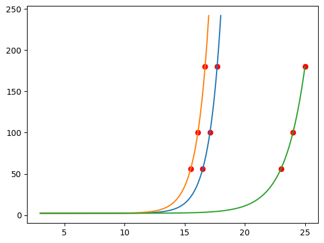

Given 

$$ba^{s_1}+c = i_1$$
$$ba^{s_2}+c = i_2$$
$$ba^{s_3}+c = i_3$$
$$ c = i_1 - ba^{s_1}$$
$$b = \frac{i_2-c}{a^{s_2}} = \frac{i_2-i_1}{a^{s_2}-a^{s_1}}$$
$$a^{s_3} = \frac{i_3-c}{b} \implies (i_2-i_1)a^{s_3} + (i_1-i_3)a^{s_2} + (i_3-i_2)a^{s_1} = 0$$

where $i$ is iscore, $s$ is in-game score, and $a,b,c$ the three parameters.







</img>